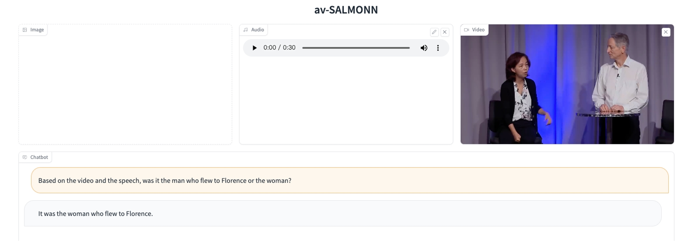
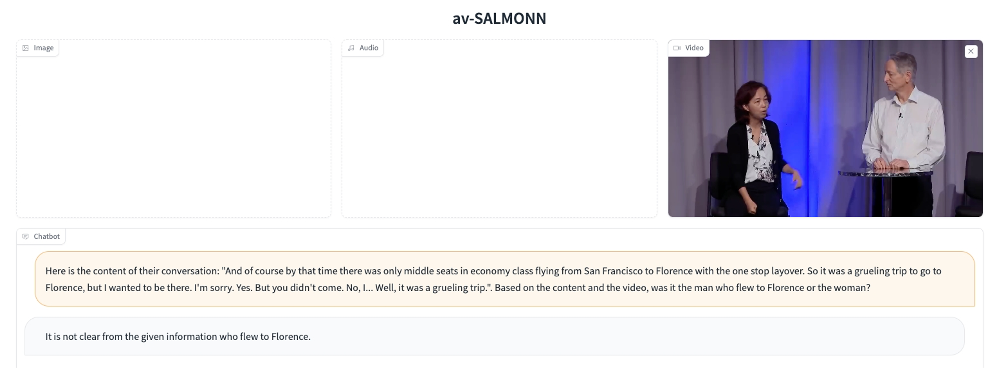
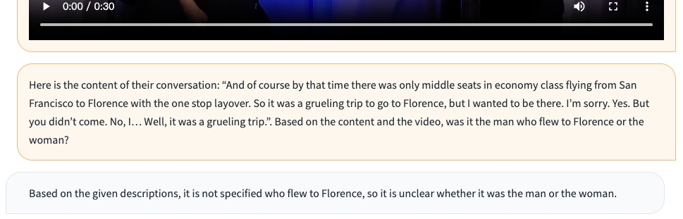

# av-SALMONN
av-SALMONN: Speech-Enhanced Audio-Visual Large Language Models

Button Specifications:

`Clear All`: clear chat history as well as all modality inputs. **Please always use clear all before you want to upload or update any image, audio or video** 

`Clear history`: only clear chat history. The modality input will remain unchanged unless you click `Clear All`.

`Submit`: submit the text in the text box to get a response

`Resubmit`: clear the previous conversation turn and then submit the text in the text box

`maximum length`, `top p` and `temperature` have their own individual meanings

Examples mentioned in the paper are provided. Please feel free to start with those.

We provide the script for evaluating speech (LibriSpeech) and audio (AudioCaps) as single-modal tasks using Video-LLaMA. Please find codes in `infer_batch.sh` and `video_llama/`
We provide the generated results for LibriSpeech (`librispeech.json` and `librispeech_finetuned.json` for finetuning 50k steps on LibriSpeech) and AudioCaps (`audiocaps.json`)

## Demo comparison between av-SALMONN and 2-stage systems
We perform a case study for the following video:
Video file: `2stage_video.mp4`

In the following three examples, the question required the model to associate the speech with the correct speaker in order to answer it. As a result, only av-SALMONN can answer it correctly, whereas the other two 2-stage systems (av-SALMONN without audio input but add ASR transcription, and Video-Llama with ASR transcription) can not answer it.
- av-SALMONN

- 2-stage av-SALMONN without audio input + ASR transcription

- 2-stage Video-Llama + ASR transcription

